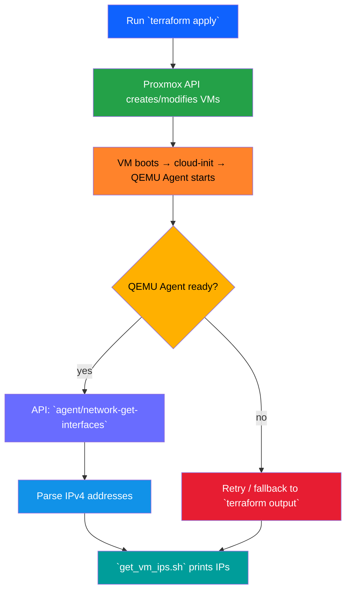

# Architecture Overview

## Project Summary
This repository implements a **GitOps‑enabled Proxmox infrastructure** using Terraform. It provisions a set of virtual machines (app, DB, monitoring, runner) from a **template VM**, injects cloud‑init snippets, and aims to discover each VM's IP address via the Proxmox QEMU guest‑agent.

---

## Components
| Component | Purpose |
|-----------|---------|
| **Terraform** | Declares the Proxmox provider, defines the VM resources, and outputs the discovered IPs. |
| **Proxmox provider (`bpg/proxmox`)** | Communicates with the Proxmox API to create VMs, upload cloud‑init snippets, and query VM state. |
| **Cloud‑init snippets** | Provide user‑data (e.g., GitLab Runner token, SSH key) for the VMs at first boot. |
| **QEMU Guest Agent** | Enables `network-get-interfaces` calls that return the VM’s network configuration after it is running. |
| **`get_vm_ips.sh`** | Helper script that queries the Proxmox API (or falls back to Terraform output) to list IPs of all VMs. |

---

## Data Flow Diagram

---

## Technical Details: BIOS Settings & Booting
In the initial configuration, the cloned VMs were configured with `bios = "ovmf"` (UEFI) while the base template VM (`debian-12-gitops-template`) was created using Legacy BIOS (`seabios`). This discrepancy prevented the cloned VMs from booting correctly (hanging on UEFI/PXE boot), which prevented the QEMU Guest Agent and Cloud-Init from running, meaning no IP addresses could be discovered. 

We updated `main.tf` to use `bios = "seabios"` to match the template, allowing the VMs to boot successfully and register their IP addresses with the guest agent.

---

## Known Issue & Fixes
- **Problem**: Script `get_vm_ips.sh` failed to retrieve IPs and reported VM status as "unknown" or "VM not running".
- **Root Cause**: The script was looking for API tokens in `terraform.tfvars`, which had empty values, while the actual secrets were stored in `secrets.auto.tfvars`.
- **Fix Implemented**: The `get_vm_ips.sh` script now supports reading API tokens from `secrets.auto.tfvars` automatically.

---

*Generated automatically by Antigravity*
